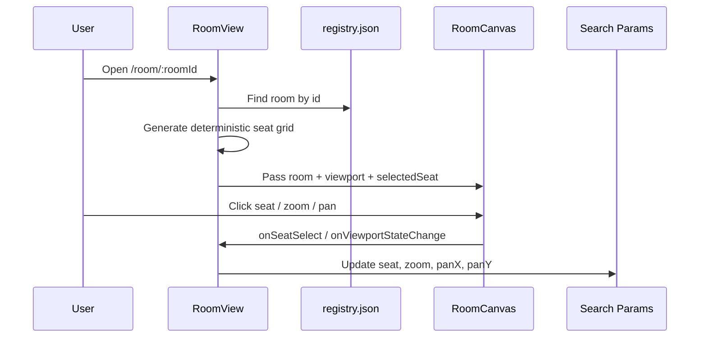

# SMU Seats Frontend

A Vite + React + TypeScript frontend for **room seat viewing** and **seat-map creation**. This project is designed to be deployable as a static SPA (including on Vercel).

## What the app does

### 1) Room discovery (`/`)
- Reads room metadata from `src/data/registry.json`
- Lists available rooms with quick links into the viewer
- Provides navigation into the map creator flow

### 2) Interactive room viewer (`/room/:roomId`)
- Resolves `roomId` from URL params
- Builds a deterministic seat grid for the selected room
- Supports:
  - seat selection
  - zoom in/out
  - pan/drag viewport
- Persists viewer state in URL query params:
  - `seat`
  - `zoom`
  - `panX`
  - `panY`

### 3) Map creator (`/create`)
- Upload floorplan assets (PNG/PDF)
- Place seats on the map canvas
- Undo/reset seat placement actions
- Export generated seat configuration as JSON

---

## Architecture overview

### Route/component flow

```mermaid
flowchart TD
  A[BrowserRouter in main.tsx] --> B[App Routes]
  B --> C[/ Home]
  B --> D[/room/:roomId]
  B --> E[/create]

  C --> F[registry.json]
  D --> F
  D --> G[RoomView]
  G --> H[RoomCanvas]
  H --> I[Seat]

  E --> J[CreateMap]
  J --> K[MapBuilder]
  K --> L[ImageUploader]
```

### Room viewer data flow



### Creator export flow


---

## Local development

```bash
npm ci
npm run dev
```

## Quality checks

```bash
npm run lint
npm run build
```

## Deploying to Vercel

This repo is configured as a Vite SPA and includes `vercel.json` rewrite rules so client-side routes (`/room/:roomId`, `/create`) resolve to `index.html` on direct refresh.

### Vercel project settings
- Framework preset: **Vite**
- Build command: `npm run build`
- Output directory: `dist`

### One-click deploy flow
1. Import the repo into Vercel
2. Keep the defaults above
3. Deploy

---

## Current limitations
- Viewer seats are generated from room dimensions (not yet persisted from creator output).
- Next step is wiring creator exports into runtime room assets/data source.
