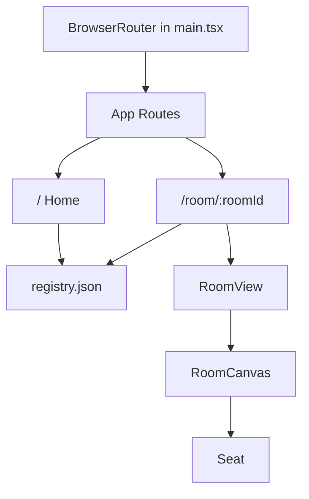
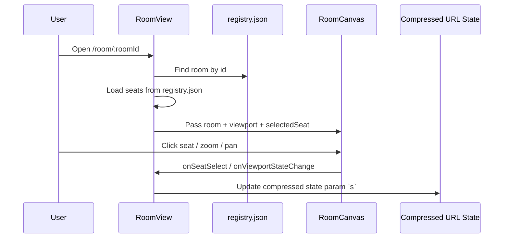

# SMU Seats Frontend

A Vite + React + TypeScript frontend for **room seat viewing** with **URL‑encoded session state**. This project is designed to be deployable as a static SPA (including on Vercel).

## What the app does

### 1) Room discovery (`/`)
- Reads room metadata from `src/data/registry.json`
- Lists available rooms with quick links into the viewer

### 2) Interactive room viewer (`/room/:roomId`)

- Resolves `roomId` from URL params
- Loads seat coordinates from `src/data/registry.json`
- Renders a PNG floorplan with an SVG seat overlay
- Supports:
  - seat selection
  - zoom in/out
  - pan/drag viewport
- Persists session state in a compressed URL param:
  - `s` (LZ‑String encoded JSON)

---

## Architecture overview

### Route/component flow



### Room viewer data flow



---

## Getting started (step‑by‑step)

1) **Install Node.js** (LTS recommended).

1) **Install dependencies:**

```bash
npm install
```

1) **Generate PNGs from PDFs** (one‑time or after PDF updates):

```bash
npm run extract:pdf
```

This will:

- Convert each one‑page PDF into a PNG in `public/maps` (2000px width)
- Update `src/data/registry.json` with image dimensions

1) **Seed seat layouts** (optional, uses a curved default layout per building):

```bash
npm run seed:seats
```

1) **Start the dev server:**

```bash
npm run dev
```

Open the app at the URL Vite prints in your terminal.

## Build & quality checks

```bash
npm run lint
npm run build
```


## Operational health checklist

Use this quick check before each deploy:

```bash
npm install
npm run extract:pdf
npm run lint
npm run build
npm run preview -- --host 0.0.0.0 --port 4174
```

Then verify:

- `/` returns 200
- `/room/lobby` returns 200 (SPA fallback)
- `/assets/...js` returns 200 (static file is **not** rewritten to HTML)

---

## Deploying to Vercel

This repo is configured as a Vite SPA and includes a filesystem-aware fallback in `vercel.json` so static assets are served normally while client-side routes (`/room/:roomId`) still resolve to `index.html` on direct refresh.

### Vercel project settings

- Framework preset: **Vite**
- Build command: `npm run build`
- Output directory: `dist`

### One-click deploy flow

1. Import the repo into Vercel
2. Keep the defaults above
3. Deploy

---

## Current limitations

- Seat coordinates are seeded or manually edited in `src/data/registry.json` (no in-app editor).
- Ensure every PDF has a matching PNG in `public/maps` and a registry entry.
