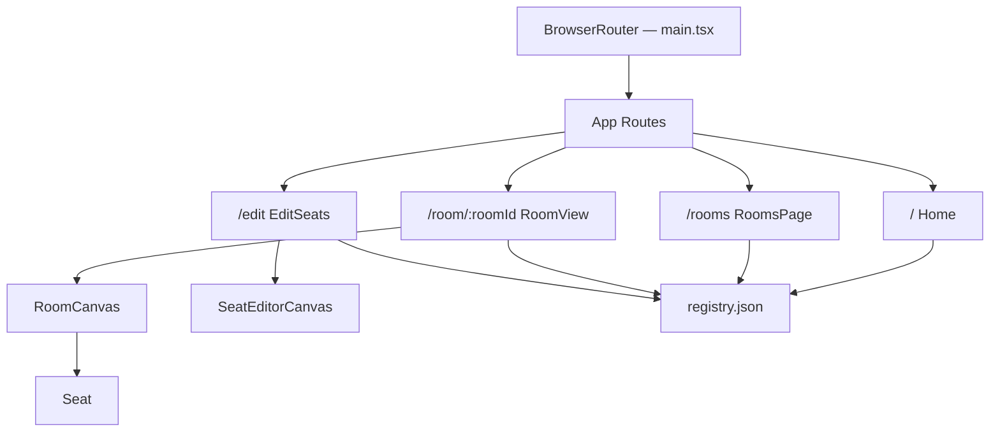
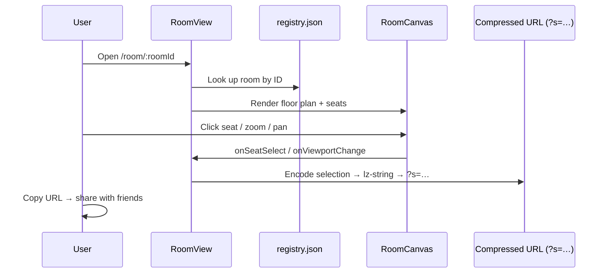

# SMU Seats

A Vite + React + TypeScript SPA that lets SMU students **browse classroom floor plans, click their seats, and share a URL** so friends know where they're sitting. Deployable as a static site on Vercel.

---

## Features

| Route | What it does |
| ----- | ------------ |
| `/` | Landing page — hero, how-it-works guide, building shortcut cards |
| `/rooms` | Filterable room browser (Building → Floor → Type) with shareable query params |
| `/room/:roomId` | Interactive seat map — click seats, zoom/pan, copy a shareable link |
| `/edit` | Contributor seat editor — add/move/delete/renumber seats, export JSON |

- Seat selections are compressed into the URL via **lz-string** so links are self-contained
- **registry.json** is the single source of truth for every room's image path, dimensions, and seat coordinates

---

## Project structure

```text
src/
  App.tsx                  # Root router — defines all client-side routes
  main.tsx                 # Entry point — mounts React inside BrowserRouter
  index.css                # All application styles (no CSS modules)
  pages/
    Home.tsx               # Landing page with hero + building cards
    RoomsPage.tsx          # Filterable room browser
    RoomView.tsx           # Interactive seat map viewer
    EditSeats.tsx          # Seat-position editor for contributors
  components/
    viewer/
      RoomCanvas.tsx       # Zoomable, pannable floor-plan canvas
      Seat.tsx             # Single interactive seat dot (React.memo)
    creator/
      SeatEditorCanvas.tsx # Editor canvas — click-to-place, drag-to-move
  hooks/
    useUrlState.ts         # Encodes/decodes seat selection in URL (?s=…)
  utils/
    roomMeta.ts            # Building config, display order, metadata parser
  data/
    registry.json          # Source of truth — rooms, images, seat coords
    registry.backup.json   # Backup copy of registry
scripts/
  refine-seats.mjs         # Auto-refine seat positions (learns from manual edits)
public/
  maps/                    # Floor-plan PNGs (one per room)
vercel.json                # SPA catch-all rewrite for Vercel deployment
```

---

## Getting started

```bash
# 1. Install dependencies
npm install

# 2. Start the dev server
npm run dev
```

Open the URL Vite prints in your terminal (usually `http://localhost:5173`).

### Build & preview

```bash
npm run lint      # ESLint check
npm run build     # Production build → dist/
npm run preview   # Serve the built output locally
```

---

## Deploying to Vercel

The repo includes a `vercel.json` with a catch-all rewrite so all client-side routes (`/rooms`, `/room/:id`, `/edit`, etc.) resolve to `index.html` on direct refresh while static assets are served normally.

### Vercel project settings

| Setting | Value |
| ------- | ----- |
| Framework preset | **Vite** |
| Build command | `npm run build` |
| Output directory | `dist` |

### One-click deploy

1. Import the repo into Vercel
2. Keep the defaults above
3. Deploy

---

## Seat editor (`/edit`)

The built-in editor at `/edit` lets contributors adjust seat positions visually:

- **Click** on the floor plan to place a new seat
- **Drag** an existing seat to reposition it
- **Right-click** or press **Delete/Backspace** to remove a seat
- **Renumber** re-labels all seats sequentially
- **Clear All** removes every seat in the room
- **Undo** (Ctrl+Z) reverts the last action
- **Export JSON** copies the seat array to clipboard — paste it into `registry.json`

### Auto-refinement script

`scripts/refine-seats.mjs` can automatically refine seat positions by learning from rooms you've already manually edited:

```bash
node scripts/refine-seats.mjs
```

It uses connected-component detection on the floor-plan PNGs, applies a 50 px merge distance to eliminate clusters, and skips rooms that already match their expected capacity.

---

## Architecture

### Route / component flow



### Seat selection data flow



---

## Contributing

1. Fork the repo and create a feature branch
2. Run `npm run lint` before committing
3. If adding or editing seat positions, use the `/edit` page and export the JSON
4. Open a PR with a clear description of what changed
